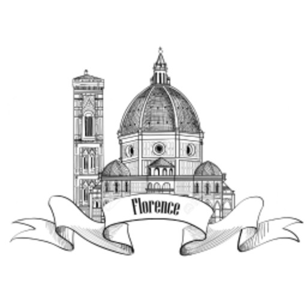
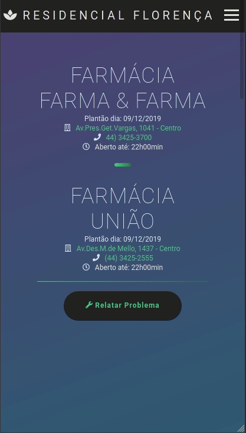
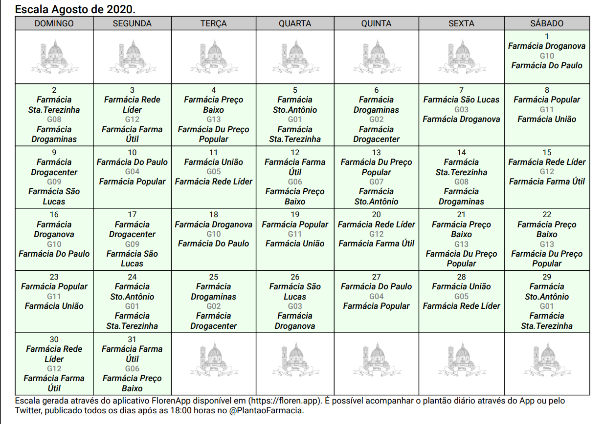

<!-- PROJECT SHIELDS -->
<!--
*** I'm using markdown "reference style" links for readability.
*** Reference links are enclosed in brackets [ ] instead of parentheses ( ).
*** See the bottom of this document for the declaration of the reference variables
*** for contributors-url, forks-url, etc. This is an optional, concise syntax you may use.
*** https://www.markdownguide.org/basic-syntax/#reference-style-links
-->
[![Contributors][contributors-shield]][contributors-url]
[![Forks][forks-shield]][forks-url]
[![Stargazers][stars-shield]][stars-url]
[![Issues][issues-shield]][issues-url]
[![MIT License][license-shield]][license-url]
[![LinkedIn][linkedin-shield]][linkedin-url]


<!-- PROJECT LOGO -->
<br />
<p align="center">
  <a href="https://residencialfloren.firebaseapp.com/">
    
  </a>

  <h3 align="center">FlorenApp</h3>

  <p align="center">
    Esse é um pequeno projeto desenvolvido com o intuito de ajudar a comunidade local e aprender novas tecnologias. Disponível em <a href="http://floren.app">http://floren.app</a>
    <br />
    
  </p>
</p>


<!-- TABLE OF CONTENTS -->
## Table of Contents

* [About the Project](#about-the-project)
  * [Built With](#built-with)
* [Getting Started](#getting-started)
  * [Prerequisites](#prerequisites)
  * [Installation](#installation)
* [Usage](#usage)
* [Roadmap](#roadmap)
* [Contributing](#contributing)
* [License](#license)
* [Contact](#contact)
* [Acknowledgements](#acknowledgements)


<!-- ABOUT THE PROJECT -->
## About The Project
Esse projeto é uma iniciativa de testar conhecimentos de programação web com algumas tecnologias que tenho interesse e resolver um problema real de um pequeno grupo de pessoas.

O que me motivou?
* Constantemente as pessoas perguntando nos grupos qual a farmácia de plantão, alguém tirava uma foto de uma escala manual impressa e começava a repassar.
* Todo dia um funcionário faz o serviço manual de colar na fachada do estabelecimento quais serão as farmácias que iram atender o plantão, desperdiçando material e tempo com algo que eu poderia automatizar utilizando o meu conhecimento. 
* Me envolver em um projeto real faria eu me sentir pertencente de fato da comunidade de programação :smile:

claro, esse projeto é realmente algo pequeno e eu pretendo adicionar mais funcionalidades conforme minha bagagem de conhecimento for aumentando. Sinta-se livre para sugerir alterações.


### Built With
Uma lista com as principais ferramentas que utilizei estará abaixo.

* [TypeScript](https://www.typescriptlang.org/)
* [MomentJS](https://momentjs.com/)
* [pdfMake](http://pdfmake.org/)
* [fontAwesome](https://fontawesome.com/)
* [SweetAlert2](https://sweetalert2.github.io/)
* [animateCss](https://github.com/daneden/animate.css)
* [forecast7](https://forecast7.com/)
* [FlorenApi](https://github.com/diegodario88/ResidencialFlorenApi)
* [mongodb](https://mongodb.com/)
* [firebase](https://firebase.google.com/?hl=pt-br)


<!-- GETTING STARTED -->
## Getting Started

To get a local copy up and running follow these simple example steps.

### Prerequisites

* npm
```sh
npm install npm@latest -g
```

### Installation

1. Open a command or terminal window.
2. Clone the repo
```sh
git clone https://github.com/diegodario88/ResidencialFloren
```
3. Install NPM packages
```sh
npm install
```
4. Enter your API in `config.js`
```JS
const API_KEY = 'ENTER YOUR API';
```


<!-- USAGE EXAMPLES -->
## Usage





<!-- ROADMAP -->
## Roadmap

See the [open issues](https://github.com/diegodario88/ResidencialFloren/issues) for a list of proposed features (and known issues).


<!-- CONTRIBUTING -->
## Contributing

Contributions are what make the open source community such an amazing place to be learn, inspire, and create. Any contributions you make are **greatly appreciated**.

1. Fork the Project
2. Create your Feature Branch (`git checkout -b feature/AmazingFeature`)
3. Commit your Changes (`git commit -m 'Add some AmazingFeature'`)
4. Push to the Branch (`git push origin feature/AmazingFeature`)
5. Open a Pull Request


<!-- LICENSE -->
## License

Distributed under the MIT License. See `LICENSE` for more information.


<!-- CONTACT -->
## Contact

Diego Dario - [@your_twitter](https://twitter.com/litlebirddd) 

Project Link: [https://github.com/diegodario88](https://github.com/diegodario88)


<!-- ACKNOWLEDGEMENTS -->
## Acknowledgements
* [GitHub Emoji Cheat Sheet](https://www.webpagefx.com/tools/emoji-cheat-sheet)
* [Img Shields](https://shields.io)
* [Choose an Open Source License](https://choosealicense.com)
* [GitHub Pages](https://pages.github.com)
* [Animate.css](https://daneden.github.io/animate.css)
* [Loaders.css](https://connoratherton.com/loaders)
* [Slick Carousel](https://kenwheeler.github.io/slick)
* [Smooth Scroll](https://github.com/cferdinandi/smooth-scroll)
* [Sticky Kit](http://leafo.net/sticky-kit)
* [JVectorMap](http://jvectormap.com)
* [Font Awesome](https://fontawesome.com)


<!-- MARKDOWN LINKS & IMAGES -->
<!-- https://www.markdownguide.org/basic-syntax/#reference-style-links -->
[contributors-shield]: https://img.shields.io/github/contributors/othneildrew/Best-README-Template.svg?style=flat-square
[contributors-url]: https://github.com/othneildrew/Best-README-Template/graphs/contributors
[forks-shield]: https://img.shields.io/github/forks/othneildrew/Best-README-Template.svg?style=flat-square
[forks-url]: https://github.com/othneildrew/Best-README-Template/network/members
[stars-shield]: https://img.shields.io/github/stars/othneildrew/Best-README-Template.svg?style=flat-square
[stars-url]: https://github.com/othneildrew/Best-README-Template/stargazers
[issues-shield]: https://img.shields.io/github/issues/othneildrew/Best-README-Template.svg?style=flat-square
[issues-url]: https://github.com/othneildrew/Best-README-Template/issues
[license-shield]: https://img.shields.io/github/license/othneildrew/Best-README-Template.svg?style=flat-square
[license-url]: https://github.com/othneildrew/Best-README-Template/blob/master/LICENSE.txt
[linkedin-shield]: https://img.shields.io/badge/-LinkedIn-black.svg?style=flat-square&logo=linkedin&colorB=555
[linkedin-url]: https://linkedin.com/in/othneildrew
[product-screenshot]: images/screenshot.png
